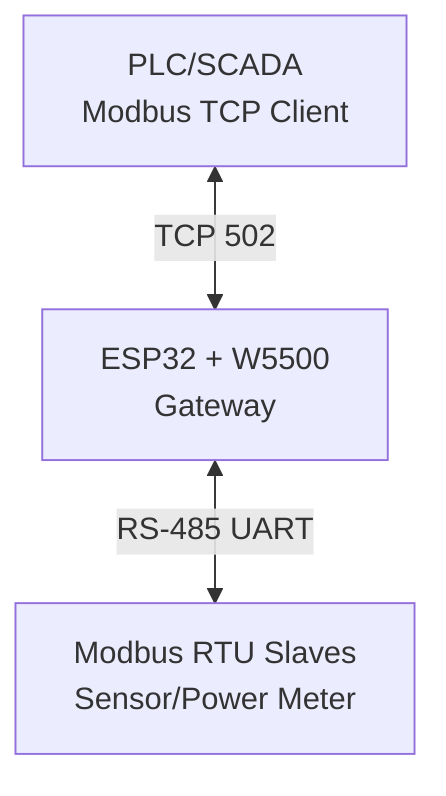

# ESPW5500_Modbus_Gateway
Modbus Gateway Library for ESP32+W5500

---

## 🏗️ ARSITEKTUR SISTEM

| Komponen           | Fungsi                                                                |
|--------------------|----------------------------------------------------------------------|
| PLC/SCADA/PC       | Bertindak sebagai **Modbus TCP Client**, mengirim request ke gateway |
| ESP32 + W5500      | Berperan sebagai **Gateway** (TCP ⇆ RTU converter)                  |
| MAX485/MAX3485     | Transceiver **RS-485** untuk komunikasi serial RTU                   |
| Modbus RTU Slaves  | Perangkat RTU (power meter, sensor, actuator)                       |

---

# 🔄 Alur Kerja Komunikasi ESP32 Gateway (TCP ⇆ RTU)

## 1. Gateway Buka TCP Server
- ESP32 + W5500 membuka **TCP Server** pada port `502`.
- PLC/SCADA/PC bertindak sebagai **Modbus TCP Client**.

## 2. TCP Request Diterima
- Frame Modbus TCP masuk dengan format:
[MBAP Header][PDU]
- **MBAP Header** terdiri dari:
- Transaction ID  
- Protocol ID  
- Length  
- Unit ID  

- **PDU (Protocol Data Unit)** terdiri dari:
[Function Code][Data]

## 3. Konversi TCP → RTU
- Gateway **membuang MBAP Header**.
- **Unit ID** dari MBAP dipakai sebagai **Slave Address RTU**.
- Tambahkan **CRC16** di akhir frame.

📦 Hasil RTU Request:
[Slave Address][Function][Data][CRC16]

## 4. Kirim RTU Request ke RS-485
- ESP32 mengaktifkan pin **DE** pada transceiver (MAX485/MAX3485).
- Frame dikirim via **UART** ke slave RTU.

## 5. Slave RTU Memproses Request
- Slave menerima permintaan.
- Slave membalas dengan RTU Response:
[Slave Address][Function][Data][CRC16]

## 6. Gateway Terima RTU Response
- ESP32 membaca frame dari UART.
- **Validasi CRC16**.

## 7. Konversi RTU → TCP
- Buang CRC16 dari frame RTU.
- Gabungkan dengan **MBAP Header** dari request awal.  
⚠️ Transaction ID harus sama agar PLC/SCADA bisa melakukan matching.

📦 Hasil TCP Response:
[MBAP Header][PDU Response]

## 8. Kirim TCP Response ke Client
- W5500 mengirimkan frame TCP ke PLC/SCADA/PC.

## 9. Gateway Idle
- Gateway siap menunggu request berikutnya dari client.

---

## ⚠️ CATATAN PENTING

- 🔧 Pastikan **baudrate UART** sama dengan RTU slave.  
- 🆔 **Unit ID** pada Modbus TCP harus sesuai dengan **slave address RTU**.  
- ⏱️ Berikan **delay kecil (10–20 ms)** antar request untuk stabilitas komunikasi.  
